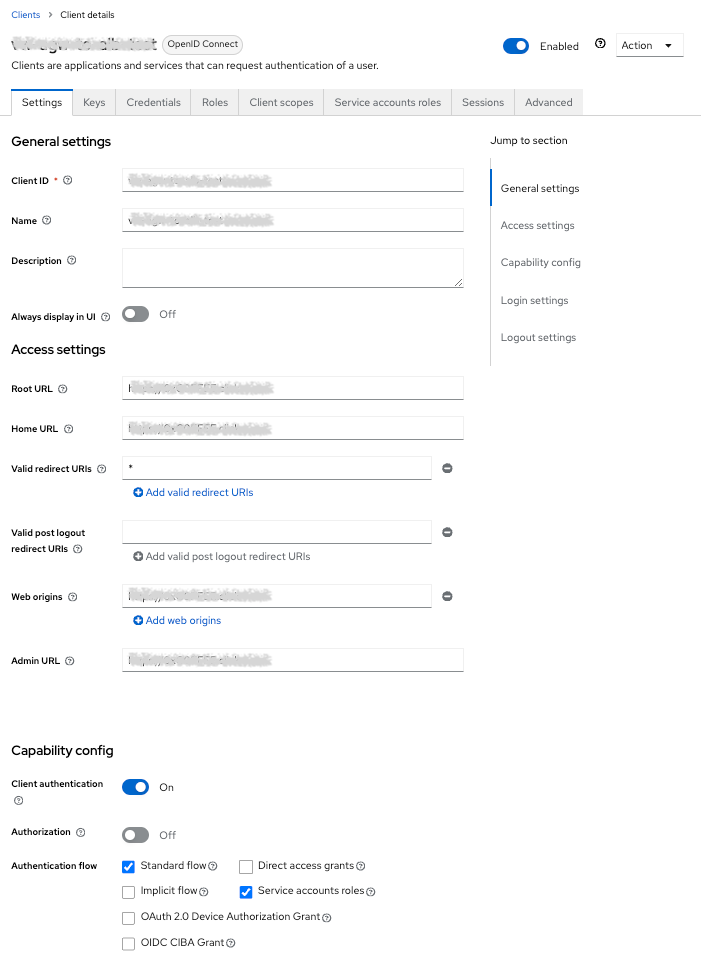
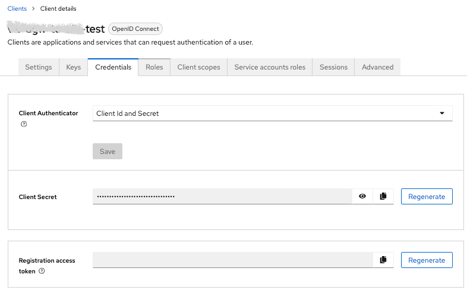
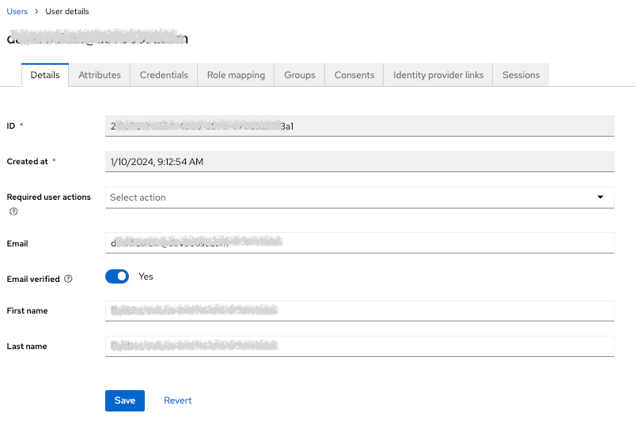
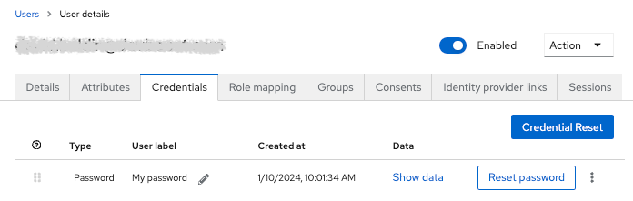

Spike demonstrating how to serve content of three lambda functions behind application load balancer with OpenID Connect authentication against external keycloak server.

# IAM Setup

The setup requires an IAM server to be running. For this example a free account on 
[cloud iam](https://www.cloud-iam.com/) was used.

The OIDC server, in this case and instance of keycloak is assumed to be running at `lemur-17.cloud-iam.com`. Note that
the name is randomly chosen by cloud-iam and has to be changed in the `template.yaml` file.

Required keycloak configurations are as follows:

## Client

It is important to enable `Client Authentication` as this enabled the `Credentials` tab. Also ensure to set `Valid redirect URLs` to `*`.

Save the values of `Client ID` and `Client Secret` as they are needed for the `template.yaml` file.

## User

You need a user as well. For testing it's okay to create one with default password and verified email. 

with credentials

# Testing

Using browser console, observe behavior of http://YOUR_DOMAIN_NAME.TLD/, https://YOUR_DOMAIN_NAME.TLD/, https://YOUR_DOMAIN_NAME.TLD/api/ and https://YOUR_DOMAIN_NAME.TLD/image/. Also compare with implementation of lambdas and template.yaml file.

# Notes

The template.yaml was not optimized towards security or compactness. It is intended to be a demonstration of the concept and make it easy to understand.